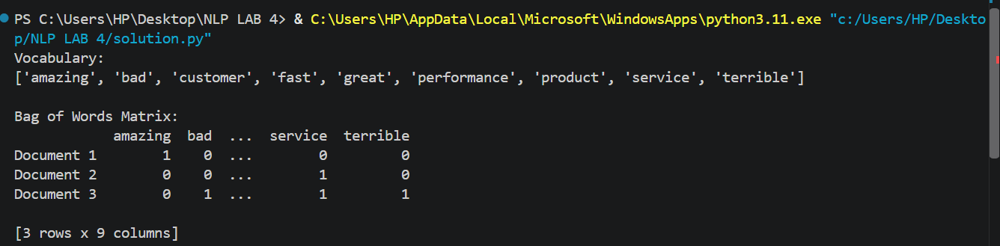
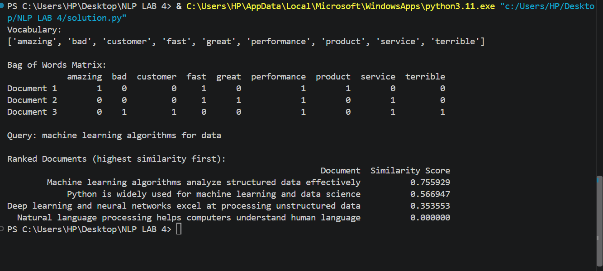

# NLP Lab 04 — Bag of Words & Cosine Similarity

**Course:** Natural Language Processing (CS-602 / DS-604)
**Student Name:** Waseem Qadir 
**Roll Number:** 2K24 / AI / 99

## Overview
This lab demonstrates:
- Representing text as numerical vectors using the Bag of Words (BoW) model
- Computing document similarity using Cosine Similarity
- Building a basic search engine that ranks documents by relevance to a query

## Task 1: Bag of Words Matrix
Used `CountVectorizer` with English stop words removed to convert 3 customer
reviews into a term-frequency matrix.

**Output:**


## Task 2: Document Search Engine
Built a mini search engine using `cosine_similarity` to rank 4 documents
against the query `"machine learning algorithms for data"`.

**Output:**


## Viva & Reflection Questions

**1. Word Order Invariance**
Bag of Words only counts word frequency and ignores order, so "Dog bites man"
and "Man bites dog" produce identical vectors since both contain the same
words the same number of times. This hurts sentiment analysis because meaning
often depends on structure and order — for example, negation ("not good") or
sarcasm can be misread since BoW has no sense of sequence.

**2. Sparsity Issue**
With a vocabulary of 100,000 unique words, each document vector has 100,000
dimensions, but any single document uses only a small fraction of those words.
This produces a highly sparse matrix (mostly zeros). Storing this densely
would waste huge amounts of memory, so it's typically stored in a sparse
matrix format, which only keeps track of non-zero values and their positions.

**3. Zero Similarity for Document 3**
Document 3 ("Natural language processing helps computers understand human
language") shares no vocabulary words with the query ("machine learning
algorithms for data") after stop word removal. Since cosine similarity is
based on the dot product of the vectors, and there is no term overlap, the
dot product is 0 — resulting in a similarity score of 0.0000 (the vectors
are orthogonal).

## How to Run
```bash
pip install numpy pandas scikit-learn
python solution.py
```